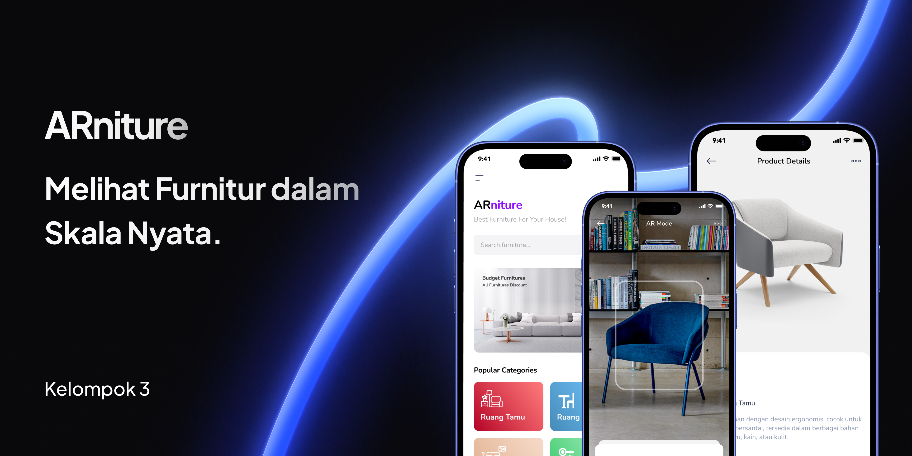

# 🌟 ARniture: Augmented Reality Furniture App 🌟

ARniture is an augmented reality (AR) application designed to revolutionize how you visualize furniture in your space! With ARniture, you can explore, customize, and place furniture virtually in your home with just a few taps. ✨

---

## 📸 Preview

---

## ✨ Features
- 🛋 **Realistic 3D Furniture Visualization**: Place furniture virtually in your space with lifelike 3D models.
- 🎨 **Customizable Options**: Change colors, textures, and sizes to match your preferences.
- 📏 **Precise Measurements**: See how furniture fits with accurate scaling.
- 🌍 **AR View**: Bring your furniture ideas to life in real-time augmented reality.

---

## 🚀 Getting Started

### 📥 Prerequisites
- Unity 2021 or later.
- AR Foundation Package.
- Compatible AR device (e.g., iOS or Android with ARCore/ARKit support).

## 👥 Contributors

We want to thank the following people for their valuable contributions to this project:

| Name         | GitHub Profile             |
|--------------|----------------------------|
| [Dhafin Rizky Aulia]  | [@DhafinRA](https://github.com/DhafinRA) |
| [Wahyu Arief Rahman] | [@Waafre's](https://github.com/Waafre) |
| [Alfhiyana]  | [@amorazl](https://github.com/amorazl) |
| [Mulyadi] | [@LyAmurus](https://github.com/LyAmurus) |

---

### 🙏 Special Thanks
- To all the contributors for their hard work and dedication! We appreciate all your efforts in making this project a success.

